# Authentication Flow

## Overview

The application uses **Keycloak** for authentication via **NextAuth.js**, implementing OAuth 2.0 / OpenID Connect (OIDC) protocol.

## Authentication Architecture

```mermaid
graph TB
    subgraph "User Layer"
        User[👤 User]
    end
    
    subgraph "Application"
        Browser[Browser]
        NextApp[Next.js App]
        Middleware[Auth Middleware]
        NextAuth[NextAuth.js]
    end
    
    subgraph "Identity Provider"
        KC[Keycloak Server]
        KCDB[(Keycloak DB)]
    end
    
    subgraph "Application Database"
        AppDB[(PostgreSQL)]
    end
    
    User -->|1. Login Request| Browser
    Browser -->|2. Redirect| NextAuth
    NextAuth -->|3. OAuth Flow| KC
    KC -->|4. Verify| KCDB
    KC -->|5. JWT Token| NextAuth
    NextAuth -->|6. Session Callback| AppDB
    AppDB -->|7. User Record| NextAuth
    NextAuth -->|8. Set Session| Browser
    Browser -->|9. Access App| Middleware
    Middleware -->|10. Validate| NextAuth
    NextAuth -->|11. Authorized| NextApp
```



## Complete Authentication Flow

### Step 1: Initial Access


### Step 2: Login Initiation


### Step 3: Keycloak Authentication


### Step 4: Token Exchange & Session Creation


### Step 5: Accessing Protected Routes


## Code Implementation

### NextAuth Configuration

**File**: `src/lib/auth.ts`

```typescript
export const authOptions: NextAuthOptions = {
  providers: [
    KeycloakProvider({
      clientId: process.env.KEYCLOAK_ID!,
      clientSecret: process.env.KEYCLOAK_SECRET!,
      issuer: process.env.KEYCLOAK_ISSUER,
    }),
  ],
  callbacks: {
    async jwt({ token, account, profile }) {
      // Store OAuth tokens and user info
      if (account) {
        token.accessToken = account.access_token;
        token.idToken = account.id_token;
        token.keycloakId = account.providerAccountId;
      }
      if (profile) {
        token.email = profile.email;
        token.name = profile.name;
      }
      return token;
    },
    
    async session({ session, token }) {
      // Sync user to database and get app user ID
      if (session.user) {
        session.idToken = token.idToken as string;
        session.user.email = token.email as string;
        session.user.name = token.name as string;

        const keycloakId = token.keycloakId as string;
        if (keycloakId) {
          let existingUser = await db.user.findFirst({
            where: { email: token.email as string },
          });

          if (!existingUser) {
            // Create new user - Prisma generates CUID
            existingUser = await db.user.create({
              data: {
                email: token.email as string,
                name: token.name as string,
                emailVerified: null,
                image: null,
              },
            });
          }
          
          // CRITICAL: Use database user ID, not Keycloak ID
          session.user.id = existingUser.id;
        }
      }
      return session;
    },
    
    async redirect({ url, baseUrl }) {
      // Redirect to submissions after login
      if (url.startsWith("/")) return `${baseUrl}${url}`;
      if (url.startsWith(baseUrl)) return url;
      return `${baseUrl}/submissions`;
    },
  },
  pages: {
    signIn: '/', // Redirect to home if not authenticated
  },
  session: {
    strategy: "jwt",
  },
};
```

### Middleware Protection

**File**: `src/middleware.ts`

```typescript
import { withAuth } from "next-auth/middleware";

export default withAuth({
  pages: {
    signIn: "/",
  },
});

export const config = {
  matcher: ["/submissions/:path*"],
};
```

## User Identity Management

### The Two User IDs

| Aspect | Keycloak ID | App User ID |
|--------|-------------|-------------|
| **Format** | UUID | CUID |
| **Example** | `fea25424-d9b2-4ec9-bdac-9d4891aa1b64` | `cmig1x2ug0000zd5igjtitf6v` |
| **Source** | Keycloak | Prisma |
| **Purpose** | Authentication | Database relationships |
| **Stored in** | JWT token | PostgreSQL |
| **Used for** | OAuth flow | Foreign keys |

### User Synchronization


### Why Email is the Link

The **email address** is the common identifier between Keycloak and your application:

1. **Keycloak** stores user email
2. **JWT token** contains email
3. **App database** uses email to find/create user
4. **Session** uses app user ID for all operations

## Session Management

### Session Structure

```typescript
interface Session {
  user: {
    id: string;        // App user ID (CUID)
    email: string;     // User email
    name: string;      // User name
  };
  idToken: string;     // Keycloak ID token
  expires: string;     // Session expiration
}
```

### Session Lifecycle


### Session Storage

- **Strategy**: JWT (stateless)
- **Storage**: HTTP-only cookie
- **Encryption**: NextAuth.js handles encryption
- **Expiration**: Configurable (default: 30 days)

## Logout Flow

### Standard Logout


### Federated Logout (Keycloak)


## Security Considerations

### Token Security
- ✅ HTTP-only cookies (prevents XSS)
- ✅ Secure flag in production (HTTPS only)
- ✅ SameSite attribute (CSRF protection)
- ✅ Token encryption (NextAuth.js)

### Session Security
- ✅ Short-lived sessions
- ✅ Automatic expiration
- ✅ Secure session storage
- ✅ CSRF token validation

### API Security
- ✅ Server-side session validation
- ✅ Protected API routes
- ✅ User-specific data filtering
- ✅ Foreign key constraints

## Troubleshooting

### Common Issues

#### 1. Session Not Persisting
**Symptom**: User logged out after page refresh  
**Cause**: Cookie not being set  
**Solution**: Check `NEXTAUTH_URL` matches your domain

#### 2. Infinite Redirect Loop
**Symptom**: Constant redirects between / and /submissions  
**Cause**: Middleware misconfiguration  
**Solution**: Verify middleware matcher patterns

#### 3. User ID Mismatch
**Symptom**: Foreign key constraint violations  
**Cause**: Using Keycloak ID instead of app user ID  
**Solution**: Ensure session callback sets `session.user.id = existingUser.id`

## Best Practices

### Do's ✅
- Always use app user ID for database operations
- Validate sessions server-side
- Handle token expiration gracefully
- Sync users on every login
- Use email as the linking field

### Don'ts ❌
- Don't use Keycloak ID for database foreign keys
- Don't store sensitive data in JWT
- Don't trust client-side session data
- Don't skip session validation
- Don't hardcode user IDs

## Testing Authentication

### Manual Testing
1. Clear cookies
2. Access protected route
3. Verify redirect to login
4. Login with Keycloak
5. Verify redirect to protected route
6. Check database for user record
7. Verify session persists on refresh
8. Logout and verify session cleared

### Automated Testing
```typescript
// Example test
describe('Authentication', () => {
  it('should redirect unauthenticated users', async () => {
    const response = await fetch('/submissions');
    expect(response.redirected).toBe(true);
    expect(response.url).toContain('/');
  });
  
  it('should create user on first login', async () => {
    // Login flow
    const user = await db.user.findFirst({
      where: { email: 'test@example.com' }
    });
    expect(user).toBeTruthy();
    expect(user.id).toMatch(/^c[a-z0-9]+$/); // CUID format
  });
});
```
