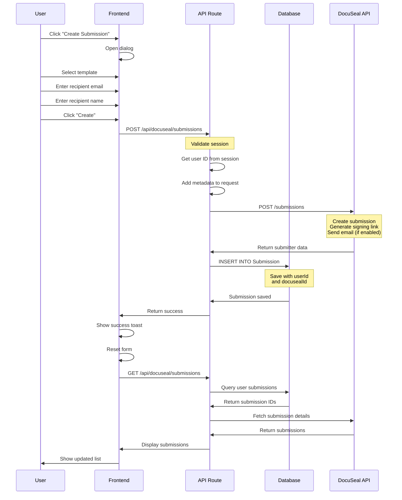
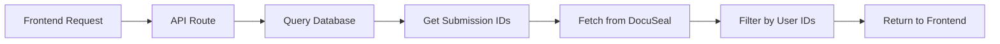
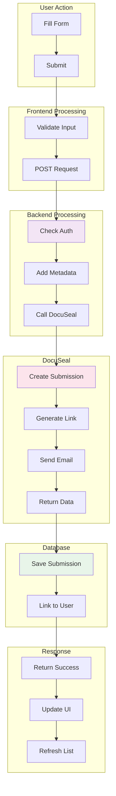
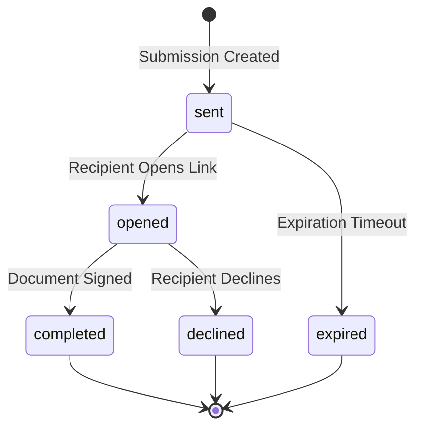

# Submission Creation Flow

## Overview

This document explains the complete flow of creating a document submission, from user interaction to database storage.

## Complete Submission Flow



## Step-by-Step Breakdown

### Step 1: User Interface

**Component**: `src/app/submissions/page.tsx`

```typescript
const onCreateSubmission = async (data: CreateSubmissionForm) => {
  setCreating(true);
  
  try {
    const payload = {
      template_id: data.template_id,
      submitters: data.submitters,
      send_email: true, // Enable email notifications
    };

    const response = await fetch('/api/docuseal/submissions', {
      method: 'POST',
      headers: { 'Content-Type': 'application/json' },
      body: JSON.stringify(payload),
    });

    if (!response.ok) {
      throw new Error('Failed to create submission');
    }

    const responseData = await response.json();
    
    toast.success('Submission created successfully!');
    reset();
    
    // Refresh submissions list
    setTimeout(async () => {
      await fetchSubmissions();
    }, 1000);
    
  } catch (error) {
    toast.error('Error creating submission');
  } finally {
    setCreating(false);
  }
};
```

### Step 2: API Route Processing

**File**: `src/app/api/docuseal/submissions/route.ts`

```typescript
export async function POST(request: Request) {
  // 1. Validate session
  const session = await getServerSession(authOptions);
  if (!session) {
    return NextResponse.json(
      { message: "Unauthorized" }, 
      { status: 401 }
    );
  }

  const userId = session.user?.id;
  const userEmail = session.user?.email;

  // 2. Parse request body
  const body = await request.json();

  // 3. Add tracking metadata
  for (let i = 0; i < body.submitters.length; i++) {
    body.submitters[i].external_id = userId;
    body.submitters[i].metadata = {
      created_by_user_id: userId,
      created_by_email: userEmail,
    };
  }

  // 4. Call DocuSeal API
  const docusealResponse = await fetch(
    `${DOCUSEAL_API_BASE_URL}/submissions`,
    {
      method: 'POST',
      headers: {
        'X-Auth-Token': process.env.DOCUSEAL_API_KEY,
        'Content-Type': 'application/json',
      },
      body: JSON.stringify(body),
    }
  );

  if (!docusealResponse.ok) {
    const errorData = await docusealResponse.json();
    return NextResponse.json(errorData, {
      status: docusealResponse.status,
    });
  }

  const data = await docusealResponse.json();

  // 5. Save to database
  try {
    const submitters = Array.isArray(data) ? data : [data];
    if (submitters[0]?.submission_id) {
      await prisma.submission.create({
        data: {
          userId: userId,
          docusealId: submitters[0].submission_id,
          status: submitters[0].status || 'pending',
          submitterEmail: submitters[0].email,
        },
      });
    }
  } catch (dbError) {
    console.error('Error saving to database:', dbError);
  }

  return NextResponse.json(data, { status: 201 });
}
```

### Step 3: DocuSeal API Processing

**What DocuSeal Does**:
1. Creates submission record
2. Generates unique signing link
3. Sends email to recipient (if `send_email: true`)
4. Returns submitter data with submission ID

**Response Format**:
```json
[
  {
    "id": 5843478,
    "submission_id": 4379019,
    "email": "recipient@example.com",
    "name": "Recipient Name",
    "status": "sent",
    "slug": "unique-slug",
    "embed_src": "https://docuseal.com/s/unique-slug",
    "sent_at": "2025-11-26T14:19:21.343Z",
    "metadata": {
      "created_by_user_id": "user-cuid",
      "created_by_email": "creator@example.com"
    }
  }
]
```

### Step 4: Database Storage

**Table**: `Submission`

```sql
INSERT INTO "Submission" (
  "id",
  "userId",
  "docusealId",
  "status",
  "submitterEmail",
  "createdAt",
  "updatedAt"
) VALUES (
  'generated-cuid',
  'user-cuid',
  4379019,
  'sent',
  'recipient@example.com',
  NOW(),
  NOW()
);
```

### Step 5: Fetching Submissions

**Flow**:


**Code**:
```typescript
export async function GET(request: Request) {
  const session = await getServerSession(authOptions);
  const userId = session.user?.id;

  // Get user's submission IDs from database
  const userSubmissions = await prisma.submission.findMany({
    where: { userId },
  });

  const submissionIds = userSubmissions.map(s => s.docusealId);

  // Fetch details from DocuSeal
  const docusealResponse = await fetch(
    `${DOCUSEAL_API_BASE_URL}/submissions`,
    {
      headers: {
        'X-Auth-Token': process.env.DOCUSEAL_API_KEY,
      },
    }
  );

  const data = await docusealResponse.json();

  // Filter to only user's submissions
  let submissions = data.data || [];
  submissions = submissions.filter(sub => 
    submissionIds.includes(sub.id)
  );

  return NextResponse.json({ data: submissions });
}
```

## Data Flow Diagram



## Request/Response Examples

### Create Submission Request

```http
POST /api/docuseal/submissions
Content-Type: application/json

{
  "template_id": 2200443,
  "submitters": [
    {
      "email": "signer@example.com",
      "name": "John Doe",
      "role": "First Party"
    }
  ],
  "send_email": true
}
```

### DocuSeal API Request (Internal)

```http
POST https://api.docuseal.com/submissions
X-Auth-Token: your-api-key
Content-Type: application/json

{
  "template_id": 2200443,
  "submitters": [
    {
      "email": "signer@example.com",
      "name": "John Doe",
      "role": "First Party",
      "external_id": "user-cuid",
      "metadata": {
        "created_by_user_id": "user-cuid",
        "created_by_email": "creator@example.com"
      }
    }
  ],
  "send_email": true
}
```

### DocuSeal API Response

```json
[
  {
    "id": 5843478,
    "submission_id": 4379019,
    "uuid": "unique-uuid",
    "email": "signer@example.com",
    "name": "John Doe",
    "status": "sent",
    "slug": "unique-slug",
    "embed_src": "https://docuseal.com/s/unique-slug",
    "sent_at": "2025-11-26T14:19:21.343Z",
    "created_at": "2025-11-26T14:19:21.346Z",
    "external_id": "user-cuid",
    "metadata": {
      "created_by_user_id": "user-cuid",
      "created_by_email": "creator@example.com"
    }
  }
]
```

## Error Handling

### Frontend Errors

```typescript
try {
  const response = await fetch('/api/docuseal/submissions', {
    method: 'POST',
    body: JSON.stringify(payload),
  });

  if (!response.ok) {
    const errorData = await response.json();
    throw new Error(errorData.message || 'Failed to create submission');
  }
} catch (error) {
  toast.error('Error creating submission', {
    description: error.message,
  });
}
```

### Backend Errors

```typescript
// Validation error
if (!body.template_id) {
  return NextResponse.json(
    { message: "template_id is required" },
    { status: 400 }
  );
}

// DocuSeal API error
if (!docusealResponse.ok) {
  const errorData = await docusealResponse.json();
  return NextResponse.json(errorData, {
    status: docusealResponse.status,
  });
}

// Database error (non-blocking)
try {
  await prisma.submission.create({...});
} catch (dbError) {
  console.error('Database save failed:', dbError);
  // Continue - submission was created in DocuSeal
}
```

## Email Notification

### When Enabled (`send_email: true`)

DocuSeal automatically:
1. Sends email to recipient
2. Includes signing link
3. Adds template information
4. Provides instructions

### Email Content

- **Subject**: "Document Signing Request"
- **Body**: Instructions and signing link
- **Link**: `https://docuseal.com/s/unique-slug`

## Status Lifecycle



## Best Practices

### Do's ✅
- Always validate user input
- Use app user ID for database operations
- Handle errors gracefully
- Refresh submissions list after creation
- Add metadata for tracking
- Enable email notifications

### Don'ts ❌
- Don't skip authentication checks
- Don't use Keycloak ID for database
- Don't ignore DocuSeal errors
- Don't block on database save failures
- Don't forget to refresh the UI

## Troubleshooting

### Submission Not Appearing

**Issue**: Submission created but not in list  
**Cause**: Database save failed (foreign key violation)  
**Solution**: Ensure `userId` is app user ID, not Keycloak ID

### Email Not Received

**Issue**: Recipient doesn't get email  
**Cause**: `send_email: false` or email in spam  
**Solution**: Set `send_email: true` and check spam folder

### Template Not Found

**Issue**: 404 error when creating submission  
**Cause**: Invalid template_id  
**Solution**: Verify template exists in DocuSeal
